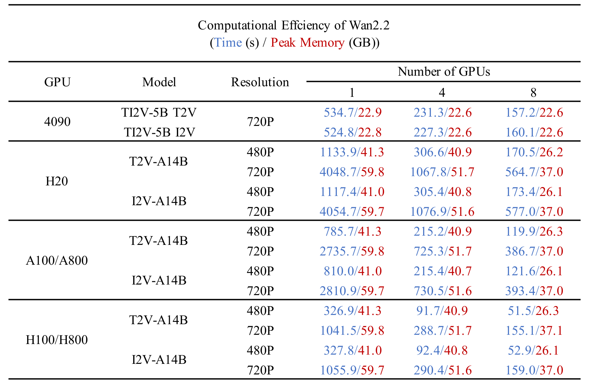
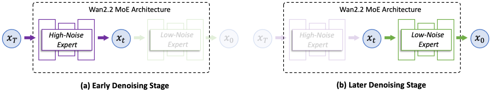
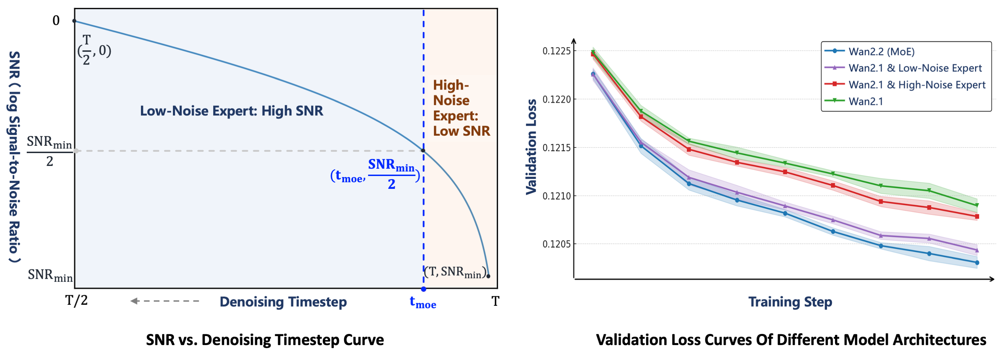
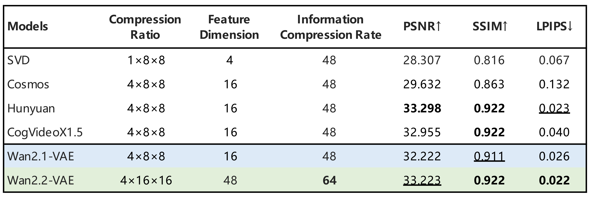
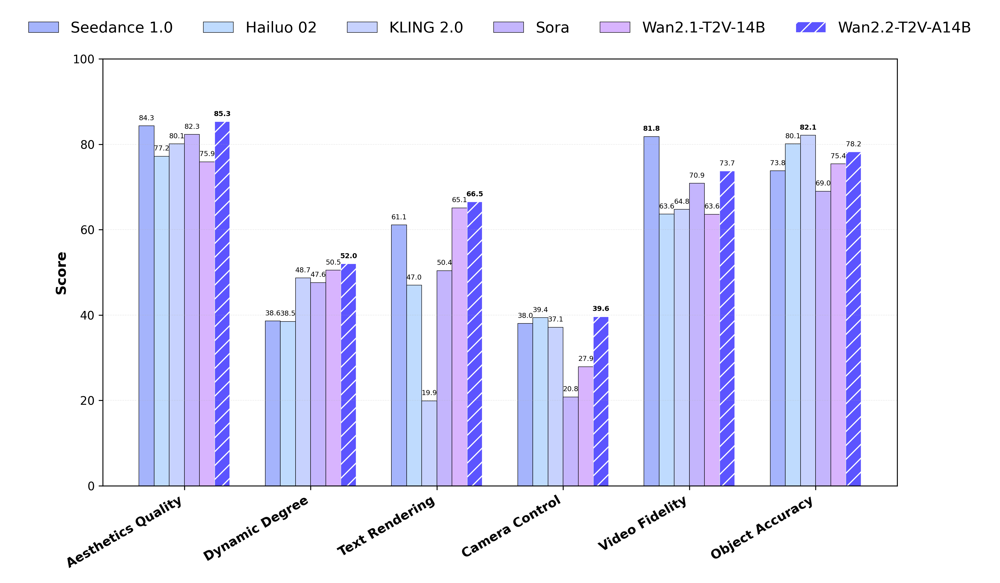

# Wan2.2

<p align="center">
    
<p>

<p align="center">
    💜 <a href="https://wan.video"><b>Wan</b></a> &nbsp&nbsp ｜ &nbsp&nbsp 🖥️ <a href="https://github.com/Wan-Video/Wan2.2">GitHub</a> &nbsp&nbsp  | &nbsp&nbsp🤗 <a href="https://huggingface.co/Wan-AI/">Hugging Face</a>&nbsp&nbsp | &nbsp&nbsp🤖 <a href="https://modelscope.cn/organization/Wan-AI">ModelScope</a>&nbsp&nbsp | &nbsp&nbsp 📑 <a href="https://arxiv.org/abs/2503.20314">论文</a> &nbsp&nbsp | &nbsp&nbsp 📑 <a href="https://wan.video/welcome?spm=a2ty_o02.30011076.0.0.6c9ee41eCcluqg">博客</a> &nbsp&nbsp |  &nbsp&nbsp 💬  <a href="https://discord.gg/AKNgpMK4Yj">Discord</a>&nbsp&nbsp
    <br>
    📕 <a href="https://alidocs.dingtalk.com/i/nodes/jb9Y4gmKWrx9eo4dCql9LlbYJGXn6lpz">使用指南(中文)</a>&nbsp&nbsp | &nbsp&nbsp 📘 <a href="https://alidocs.dingtalk.com/i/nodes/EpGBa2Lm8aZxe5myC99MelA2WgN7R35y">User Guide(English)</a>&nbsp&nbsp | &nbsp&nbsp💬 <a href="https://gw.alicdn.com/imgextra/i2/O1CN01tqjWFi1ByuyehkTSB_!!6000000000015-0-tps-611-1279.jpg">WeChat(微信)</a>&nbsp&nbsp
<br>

-----

[**Wan：开放且先进的大规模视频生成模型**](https://arxiv.org/abs/2503.20314) <be>

我们很高兴介绍 **Wan2.2**，这是对我们基础视频模型的一次重大升级。在 **Wan2.2** 中，我们重点融入了以下创新：

- 👍 **高效 MoE 架构**：Wan2.2 将混合专家（Mixture-of-Experts, MoE）架构引入视频扩散模型。通过在不同时间步的去噪过程中划分专门的强大专家模型，它在保持相同计算成本的同时扩大了整体模型容量。

- 👍 **电影级美学**：Wan2.2 引入了经过精心筛选的美学数据，并配备照明、构图、对比度、色调等细粒度标签。这使模型能够更精确、可控地生成电影风格视频，便于创作符合自定义审美偏好的内容。

- 👍 **复杂运动生成**：与 Wan2.1 相比，Wan2.2 使用显著更大规模的数据训练，图片数量增加 65.6%，视频数量增加 83.2%。这种扩展明显增强了模型在运动、语义和美学等多个维度上的泛化能力，并在开源和闭源模型中取得顶尖表现。

- 👍 **高效高清混合 TI2V**：Wan2.2 开源了一个 5B 模型，基于先进的 Wan2.2-VAE，压缩比达到 **16×16×4**。该模型支持 720P、24fps 的文生视频和图生视频，也可在 4090 等消费级显卡上运行。它是当前最快的 **720P@24fps** 模型之一，可同时服务工业界和学术界。

## 视频演示

<div align="center">
  <video src="https://github.com/user-attachments/assets/b63bfa58-d5d7-4de6-a1a2-98970b06d9a7" width="70%" poster=""> </video>
</div>

## 🔥 最新动态！！

* 2025 年 11 月 13 日：👋 Wan2.2-Animate-14B 已集成进 Diffusers（[PR](https://github.com/huggingface/diffusers/pull/12526)，[权重](https://huggingface.co/Wan-AI/Wan2.2-Animate-14B-Diffusers)）。感谢所有社区贡献者，欢迎体验！
* 2025 年 9 月 19 日：💃 我们推出 **[Wan2.2-Animate-14B](https://humanaigc.github.io/wan-animate)**，这是一个用于角色动画和角色替换的统一模型，可整体复刻动作与表情。我们发布了[模型权重](#模型下载)和[推理代码](#运行-wan-animate)。你可以在 [wan.video](https://wan.video/)、[ModelScope Studio](https://www.modelscope.cn/studios/Wan-AI/Wan2.2-Animate) 或 [HuggingFace Space](https://huggingface.co/spaces/Wan-AI/Wan2.2-Animate) 上体验！
* 2025 年 8 月 26 日：🎵 我们推出 **[Wan2.2-S2V-14B](https://humanaigc.github.io/wan-s2v-webpage)**，这是一个音频驱动的电影级视频生成模型，包含[推理代码](#运行语音到视频生成)、[模型权重](#模型下载)和[技术报告](https://humanaigc.github.io/wan-s2v-webpage/content/wan-s2v.pdf)！现在你可以在 [wan.video](https://wan.video/)、[ModelScope Gradio](https://www.modelscope.cn/studios/Wan-AI/Wan2.2-S2V) 或 [HuggingFace Gradio](https://huggingface.co/spaces/Wan-AI/Wan2.2-S2V) 上体验！
* 2025 年 7 月 28 日：👋 我们基于 TI2V-5B 模型开放了一个 [HF Space](https://huggingface.co/spaces/Wan-AI/Wan-2.2-5B)，欢迎体验！
* 2025 年 7 月 28 日：👋 Wan2.2 已集成进 ComfyUI（[中文](https://docs.comfy.org/zh-CN/tutorials/video/wan/wan2_2) | [英文](https://docs.comfy.org/tutorials/video/wan/wan2_2)）。欢迎体验！
* 2025 年 7 月 28 日：👋 Wan2.2 的 T2V、I2V 和 TI2V 已集成进 Diffusers（[T2V-A14B](https://huggingface.co/Wan-AI/Wan2.2-T2V-A14B-Diffusers) | [I2V-A14B](https://huggingface.co/Wan-AI/Wan2.2-I2V-A14B-Diffusers) | [TI2V-5B](https://huggingface.co/Wan-AI/Wan2.2-TI2V-5B-Diffusers)）。欢迎尝试！
* 2025 年 7 月 28 日：👋 我们发布了 **Wan2.2** 的推理代码和模型权重。
* 2025 年 9 月 5 日：👋 我们为语音到视频生成任务新增了基于 [CosyVoice](https://github.com/FunAudioLLM/CosyVoice) 的文本转语音合成支持。

## 社区作品

如果你的研究或项目基于 [**Wan2.1**](https://github.com/Wan-Video/Wan2.1) 或 [**Wan2.2**](https://github.com/Wan-Video/Wan2.2) 构建，并希望让更多人看到，欢迎告知我们。

- [Prompt Relay](https://github.com/GordonChen19/Prompt-Relay)：一个即插即用的推理时视频生成时序控制方法。Prompt Relay 可以提升视频质量，并让用户精确控制视频中每个时刻发生的内容。更多详情请访问其[网页](https://gordonchen19.github.io/Prompt-Relay/)。
- [Helios](https://github.com/PKU-YuanGroup/Helios)：一个基于 **Wan2.1** 的突破性视频生成模型，可在单张 H100 GPU 上以 19.5 FPS 生成分钟级高质量视频（单张昇腾 NPU 约 10 FPS），且不依赖传统长视频防漂移策略或标准视频加速技术。更多详情请访问其[网页](https://pku-yuangroup.github.io/Helios-Page/)。
- [LightX2V](https://github.com/ModelTC/LightX2V)：一个轻量高效的视频生成框架，集成 **Wan2.1** 与 **Wan2.2**，支持多种工程加速技术以实现快速推理。[LightX2V-HuggingFace](https://huggingface.co/lightx2v) 提供多种基于 Wan 的步数蒸馏模型、量化模型和轻量 VAE 模型。
- [HuMo](https://github.com/Phantom-video/HuMo)：提出了一个基于 **Wan** 的统一人类中心框架，可从文本、图像和音频等多模态输入生成高质量、细粒度、可控的人物视频。更多详情请访问其[网页](https://phantom-video.github.io/HuMo/)。
- [FastVideo](https://github.com/hao-ai-lab/FastVideo)：包含带稀疏注意力的蒸馏版 **Wan** 模型，可显著加快推理速度。
- [Cache-dit](https://github.com/vipshop/cache-dit)：为 **Wan2.2** MoE 提供基于 DBCache、TaylorSeer 和 Cache CFG 的全缓存加速支持。更多详情请访问其[示例](https://github.com/vipshop/cache-dit/blob/main/examples/pipeline/run_wan_2.2.py)。
- [Kijai's ComfyUI WanVideoWrapper](https://github.com/kijai/ComfyUI-WanVideoWrapper)：ComfyUI 中 **Wan** 模型的另一种实现。由于专注于 Wan，它在前沿优化和热门研究特性的适配上非常及时，而这些特性通常较难快速集成进结构更固定的 ComfyUI。
- [DiffSynth-Studio](https://github.com/modelscope/DiffSynth-Studio)：为 **Wan 2.2** 提供全面支持，包括低显存逐层 offload、FP8 量化、序列并行、LoRA 训练和完整训练。

## 📑 待办列表

- Wan2.2 文生视频
    - [x] A14B 与 14B 模型的多 GPU 推理代码
    - [x] A14B 与 14B 模型的检查点
    - [x] ComfyUI 集成
    - [x] Diffusers 集成
- Wan2.2 图生视频
    - [x] A14B 模型的多 GPU 推理代码
    - [x] A14B 模型的检查点
    - [x] ComfyUI 集成
    - [x] Diffusers 集成
- Wan2.2 文图到视频
    - [x] 5B 模型的多 GPU 推理代码
    - [x] 5B 模型的检查点
    - [x] ComfyUI 集成
    - [x] Diffusers 集成
- Wan2.2-S2V 语音到视频
    - [x] Wan2.2-S2V 的推理代码
    - [x] Wan2.2-S2V-14B 的检查点
    - [x] ComfyUI 集成
    - [x] Diffusers 集成
- Wan2.2-Animate 角色动画和替换
    - [x] Wan2.2-Animate 的推理代码
    - [x] Wan2.2-Animate 的检查点
    - [x] ComfyUI 集成
    - [x] Diffusers 集成

## 运行 Wan2.2

#### 安装

克隆仓库：
```sh
git clone https://github.com/Wan-Video/Wan2.2.git
cd Wan2.2
```

安装依赖：
```sh
# 确保 torch >= 2.4.0
# 如果 `flash_attn` 安装失败，请先安装其他包，最后再安装 `flash_attn`
pip install -r requirements.txt
# 如果希望在语音到视频生成中使用 CosyVoice 合成语音，请额外安装 requirements_s2v.txt
pip install -r requirements_s2v.txt
```

#### 模型下载

| 模型 | 下载链接 | 描述 |
|--------------------|---------------------------------------------------------------------------------------------------------------------------------------------|-------------|
| T2V-A14B | 🤗 [Huggingface](https://huggingface.co/Wan-AI/Wan2.2-T2V-A14B) 🤖 [ModelScope](https://modelscope.cn/models/Wan-AI/Wan2.2-T2V-A14B) | 文生视频 MoE 模型，支持 480P 与 720P |
| I2V-A14B | 🤗 [Huggingface](https://huggingface.co/Wan-AI/Wan2.2-I2V-A14B) 🤖 [ModelScope](https://modelscope.cn/models/Wan-AI/Wan2.2-I2V-A14B) | 图生视频 MoE 模型，支持 480P 与 720P |
| TI2V-5B | 🤗 [Huggingface](https://huggingface.co/Wan-AI/Wan2.2-TI2V-5B) 🤖 [ModelScope](https://modelscope.cn/models/Wan-AI/Wan2.2-TI2V-5B) | 高压缩 VAE，T2V+I2V，支持 720P |
| S2V-14B | 🤗 [Huggingface](https://huggingface.co/Wan-AI/Wan2.2-S2V-14B) 🤖 [ModelScope](https://modelscope.cn/models/Wan-AI/Wan2.2-S2V-14B) | 语音到视频模型，支持 480P 与 720P |
| Animate-14B | 🤗 [Huggingface](https://huggingface.co/Wan-AI/Wan2.2-Animate-14B) 🤖 [ModelScope](https://www.modelscope.cn/models/Wan-AI/Wan2.2-Animate-14B) | 角色动画与替换 | |

> 💡注意：
> TI2V-5B 模型支持以 **24 FPS** 生成 720P 视频。

使用 huggingface-cli 下载模型：
``` sh
pip install "huggingface_hub[cli]"
huggingface-cli download Wan-AI/Wan2.2-T2V-A14B --local-dir ./Wan2.2-T2V-A14B
```

使用 modelscope-cli 下载模型：
``` sh
pip install modelscope
modelscope download Wan-AI/Wan2.2-T2V-A14B --local_dir ./Wan2.2-T2V-A14B
```

#### 运行文生视频生成

本仓库支持 `Wan2.2-T2V-A14B` 文生视频模型，可同时支持 480P 和 720P 分辨率的视频生成。

##### (1) 不使用提示词扩展

为了便于实现，我们先从一个跳过[提示词扩展](#2-使用提示词扩展)步骤的基础推理流程开始。

- 单 GPU 推理

``` sh
python generate.py  --task t2v-A14B --size 1280*720 --ckpt_dir ./Wan2.2-T2V-A14B --offload_model True --convert_model_dtype --prompt "Two anthropomorphic cats in comfy boxing gear and bright gloves fight intensely on a spotlighted stage."
```

> 💡 该命令可在至少 80GB 显存的 GPU 上运行。

> 💡 如果遇到 OOM（显存不足）问题，可以使用 `--offload_model True`、`--convert_model_dtype` 和 `--t5_cpu` 选项来降低 GPU 显存占用。

- 使用 FSDP + DeepSpeed Ulysses 进行多 GPU 推理

  我们使用 [PyTorch FSDP](https://docs.pytorch.org/docs/stable/fsdp.html) 和 [DeepSpeed Ulysses](https://arxiv.org/abs/2309.14509) 加速推理。

``` sh
torchrun --nproc_per_node=8 generate.py --task t2v-A14B --size 1280*720 --ckpt_dir ./Wan2.2-T2V-A14B --dit_fsdp --t5_fsdp --ulysses_size 8 --prompt "Two anthropomorphic cats in comfy boxing gear and bright gloves fight intensely on a spotlighted stage."
```

##### (2) 使用提示词扩展

扩展提示词可以有效丰富生成视频的细节，进一步提升视频质量。因此，我们建议启用提示词扩展。我们提供以下两种提示词扩展方式：

- 使用 Dashscope API 进行扩展。
  - 提前申请 `dashscope.api_key`（[英文](https://www.alibabacloud.com/help/en/model-studio/getting-started/first-api-call-to-qwen) | [中文](https://help.aliyun.com/zh/model-studio/getting-started/first-api-call-to-qwen)）。
  - 配置环境变量 `DASH_API_KEY` 指定 Dashscope API key。阿里云国际站用户还需要将环境变量 `DASH_API_URL` 设置为 `https://dashscope-intl.aliyuncs.com/api/v1`。更详细说明请参考 [dashscope 文档](https://www.alibabacloud.com/help/en/model-studio/developer-reference/use-qwen-by-calling-api?spm=a2c63.p38356.0.i1)。
  - 文生视频任务使用 `qwen-plus` 模型，图生视频任务使用 `qwen-vl-max` 模型。
  - 你可以通过参数 `--prompt_extend_model` 修改用于扩展的模型。例如：
```sh
DASH_API_KEY=your_key torchrun --nproc_per_node=8 generate.py  --task t2v-A14B --size 1280*720 --ckpt_dir ./Wan2.2-T2V-A14B --dit_fsdp --t5_fsdp --ulysses_size 8 --prompt "Two anthropomorphic cats in comfy boxing gear and bright gloves fight intensely on a spotlighted stage" --use_prompt_extend --prompt_extend_method 'dashscope' --prompt_extend_target_lang 'zh'
```

- 使用本地模型进行扩展。

  - 默认使用 HuggingFace 上的 Qwen 模型进行扩展。用户可以根据可用 GPU 显存选择 Qwen 模型或其他模型。
  - 文生视频任务可以使用 `Qwen/Qwen2.5-14B-Instruct`、`Qwen/Qwen2.5-7B-Instruct` 和 `Qwen/Qwen2.5-3B-Instruct` 等模型。
  - 图生视频任务可以使用 `Qwen/Qwen2.5-VL-7B-Instruct` 和 `Qwen/Qwen2.5-VL-3B-Instruct` 等模型。
  - 更大的模型通常带来更好的扩展效果，但需要更多 GPU 显存。
  - 你可以通过参数 `--prompt_extend_model` 修改用于扩展的模型，可指定本地模型路径或 Hugging Face 模型。例如：

``` sh
torchrun --nproc_per_node=8 generate.py  --task t2v-A14B --size 1280*720 --ckpt_dir ./Wan2.2-T2V-A14B --dit_fsdp --t5_fsdp --ulysses_size 8 --prompt "Two anthropomorphic cats in comfy boxing gear and bright gloves fight intensely on a spotlighted stage" --use_prompt_extend --prompt_extend_method 'local_qwen' --prompt_extend_target_lang 'zh'
```

#### 运行图生视频生成

本仓库支持 `Wan2.2-I2V-A14B` 图生视频模型，可同时支持 480P 和 720P 分辨率的视频生成。

- 单 GPU 推理
```sh
python generate.py --task i2v-A14B --size 1280*720 --ckpt_dir ./Wan2.2-I2V-A14B --offload_model True --convert_model_dtype --image examples/i2v_input.JPG --prompt "Summer beach vacation style, a white cat wearing sunglasses sits on a surfboard. The fluffy-furred feline gazes directly at the camera with a relaxed expression. Blurred beach scenery forms the background featuring crystal-clear waters, distant green hills, and a blue sky dotted with white clouds. The cat assumes a naturally relaxed posture, as if savoring the sea breeze and warm sunlight. A close-up shot highlights the feline's intricate details and the refreshing atmosphere of the seaside."
```

> 该命令可在至少 80GB 显存的 GPU 上运行。

> 💡 对于图生视频任务，`size` 参数表示生成视频的面积，宽高比会跟随原始输入图像。

- 使用 FSDP + DeepSpeed Ulysses 进行多 GPU 推理

```sh
torchrun --nproc_per_node=8 generate.py --task i2v-A14B --size 1280*720 --ckpt_dir ./Wan2.2-I2V-A14B --image examples/i2v_input.JPG --dit_fsdp --t5_fsdp --ulysses_size 8 --prompt "Summer beach vacation style, a white cat wearing sunglasses sits on a surfboard. The fluffy-furred feline gazes directly at the camera with a relaxed expression. Blurred beach scenery forms the background featuring crystal-clear waters, distant green hills, and a blue sky dotted with white clouds. The cat assumes a naturally relaxed posture, as if savoring the sea breeze and warm sunlight. A close-up shot highlights the feline's intricate details and the refreshing atmosphere of the seaside."
```

- 无提示词图生视频生成

```sh
DASH_API_KEY=your_key torchrun --nproc_per_node=8 generate.py --task i2v-A14B --size 1280*720 --ckpt_dir ./Wan2.2-I2V-A14B --prompt '' --image examples/i2v_input.JPG --dit_fsdp --t5_fsdp --ulysses_size 8 --use_prompt_extend --prompt_extend_method 'dashscope'
```

> 💡 模型可以仅基于输入图像生成视频。你可以使用提示词扩展从图像生成提示词。

> 提示词扩展流程可参考[这里](#2-使用提示词扩展)。

#### 运行文图到视频生成

本仓库支持 `Wan2.2-TI2V-5B` 文图到视频模型，可支持 720P 分辨率的视频生成。

- 单 GPU 文生视频推理
```sh
python generate.py --task ti2v-5B --size 1280*704 --ckpt_dir ./Wan2.2-TI2V-5B --offload_model True --convert_model_dtype --t5_cpu --prompt "Two anthropomorphic cats in comfy boxing gear and bright gloves fight intensely on a spotlighted stage"
```

> 💡 与其他任务不同，文图到视频任务的 720P 分辨率为 `1280*704` 或 `704*1280`。

> 该命令可在至少 24GB 显存的 GPU 上运行（例如 RTX 4090 GPU）。

> 💡 如果你使用至少 80GB 显存的 GPU，可以移除 `--offload_model True`、`--convert_model_dtype` 和 `--t5_cpu` 选项以加快执行速度。

- 单 GPU 图生视频推理
```sh
python generate.py --task ti2v-5B --size 1280*704 --ckpt_dir ./Wan2.2-TI2V-5B --offload_model True --convert_model_dtype --t5_cpu --image examples/i2v_input.JPG --prompt "Summer beach vacation style, a white cat wearing sunglasses sits on a surfboard. The fluffy-furred feline gazes directly at the camera with a relaxed expression. Blurred beach scenery forms the background featuring crystal-clear waters, distant green hills, and a blue sky dotted with white clouds. The cat assumes a naturally relaxed posture, as if savoring the sea breeze and warm sunlight. A close-up shot highlights the feline's intricate details and the refreshing atmosphere of the seaside."
```

> 💡 如果配置了 image 参数，则执行图生视频；否则默认执行文生视频。

> 💡 与图生视频类似，`size` 参数表示生成视频的面积，宽高比会跟随原始输入图像。

- 使用 FSDP + DeepSpeed Ulysses 进行多 GPU 推理

```sh
torchrun --nproc_per_node=8 generate.py --task ti2v-5B --size 1280*704 --ckpt_dir ./Wan2.2-TI2V-5B --dit_fsdp --t5_fsdp --ulysses_size 8 --image examples/i2v_input.JPG --prompt "Summer beach vacation style, a white cat wearing sunglasses sits on a surfboard. The fluffy-furred feline gazes directly at the camera with a relaxed expression. Blurred beach scenery forms the background featuring crystal-clear waters, distant green hills, and a blue sky dotted with white clouds. The cat assumes a naturally relaxed posture, as if savoring the sea breeze and warm sunlight. A close-up shot highlights the feline's intricate details and the refreshing atmosphere of the seaside."
```

> 提示词扩展流程可参考[这里](#2-使用提示词扩展)。

#### 运行语音到视频生成

本仓库支持 `Wan2.2-S2V-14B` 语音到视频模型，可同时支持 480P 和 720P 分辨率的视频生成。

- 单 GPU 语音到视频推理

```sh
python generate.py  --task s2v-14B --size 1024*704 --ckpt_dir ./Wan2.2-S2V-14B/ --offload_model True --convert_model_dtype --prompt "Summer beach vacation style, a white cat wearing sunglasses sits on a surfboard."  --image "examples/i2v_input.JPG" --audio "examples/talk.wav"
# 不设置 --num_clip 时，生成视频长度会根据输入音频长度自动调整

# 可以通过 --enable_tts 使用 CosyVoice 生成音频
python generate.py  --task s2v-14B --size 1024*704 --ckpt_dir ./Wan2.2-S2V-14B/ --offload_model True --convert_model_dtype --prompt "Summer beach vacation style, a white cat wearing sunglasses sits on a surfboard."  --image "examples/i2v_input.JPG" --enable_tts --tts_prompt_audio "examples/zero_shot_prompt.wav" --tts_prompt_text "希望你以后能够做的比我还好呦。" --tts_text "收到好友从远方寄来的生日礼物，那份意外的惊喜与深深的祝福让我心中充满了甜蜜的快乐，笑容如花儿般绽放。"
```

> 💡 该命令可在至少 80GB 显存的 GPU 上运行。

- 使用 FSDP + DeepSpeed Ulysses 进行多 GPU 推理

```sh
torchrun --nproc_per_node=8 generate.py --task s2v-14B --size 1024*704 --ckpt_dir ./Wan2.2-S2V-14B/ --dit_fsdp --t5_fsdp --ulysses_size 8 --prompt "Summer beach vacation style, a white cat wearing sunglasses sits on a surfboard." --image "examples/i2v_input.JPG" --audio "examples/talk.wav"
```

- 姿态 + 音频驱动生成

```sh
torchrun --nproc_per_node=8 generate.py --task s2v-14B --size 1024*704 --ckpt_dir ./Wan2.2-S2V-14B/ --dit_fsdp --t5_fsdp --ulysses_size 8 --prompt "a person is singing" --image "examples/pose.png" --audio "examples/sing.MP3" --pose_video "./examples/pose.mp4" 
```

> 💡 对于语音到视频任务，`size` 参数表示生成视频的面积，宽高比会跟随原始输入图像。

> 💡 模型可以结合音频输入、参考图像和可选文本提示词生成视频。

> 💡 `--pose_video` 参数启用姿态驱动生成，使模型在生成与音频同步的视频时遵循特定姿态序列。

> 💡 `--num_clip` 参数控制生成的视频片段数量，适用于以更短生成时间进行快速预览。

请访问我们的项目页面，查看更多示例并了解该模型适用的场景。

#### 运行 Wan-Animate

Wan-Animate 以视频和角色图像作为输入，并以“动画”或“替换”模式生成视频。

1. 动画模式：模型生成角色图像的视频，并模仿输入视频中的人物动作。
2. 替换模式：模型使用输入视频替换角色图像。

请访问我们的[项目页面](https://humanaigc.github.io/wan-animate)，查看更多示例并了解该模型适用的场景。

##### (1) 预处理

输入视频在进入推理流程前需要预处理为若干素材。请参考以下处理流程，预处理的更多细节可查看 [UserGuider](https://github.com/Wan-Video/Wan2.2/blob/main/wan/modules/animate/preprocess/UserGuider.md)。

* 动画模式
```bash
python ./wan/modules/animate/preprocess/preprocess_data.py \
    --ckpt_path ./Wan2.2-Animate-14B/process_checkpoint \
    --video_path ./examples/wan_animate/animate/video.mp4 \
    --refer_path ./examples/wan_animate/animate/image.jpeg \
    --save_path ./examples/wan_animate/animate/process_results \
    --resolution_area 1280 720 \
    --retarget_flag \
    --use_flux
```

* 替换模式
```bash
python ./wan/modules/animate/preprocess/preprocess_data.py \
    --ckpt_path ./Wan2.2-Animate-14B/process_checkpoint \
    --video_path ./examples/wan_animate/replace/video.mp4 \
    --refer_path ./examples/wan_animate/replace/image.jpeg \
    --save_path ./examples/wan_animate/replace/process_results \
    --resolution_area 1280 720 \
    --iterations 3 \
    --k 7 \
    --w_len 1 \
    --h_len 1 \
    --replace_flag
```

##### (2) 以动画模式运行

* 单 GPU 推理

```bash
python generate.py --task animate-14B --ckpt_dir ./Wan2.2-Animate-14B/ --src_root_path ./examples/wan_animate/animate/process_results/ --refert_num 1
```

* 使用 FSDP + DeepSpeed Ulysses 进行多 GPU 推理

```bash
python -m torch.distributed.run --nnodes 1 --nproc_per_node 8 generate.py --task animate-14B --ckpt_dir ./Wan2.2-Animate-14B/ --src_root_path ./examples/wan_animate/animate/process_results/ --refert_num 1 --dit_fsdp --t5_fsdp --ulysses_size 8
```

* Diffusers Pipeline

```python
from diffusers import WanAnimatePipeline
from diffusers.utils import export_to_video, load_image, load_video

device = "cuda:0"
dtype = torch.bfloat16
model_id = "Wan-AI/Wan2.2-Animate-14B-Diffusers"
pipe = WanAnimatePipeline.from_pretrained(model_id torch_dtype=dtype)
pipe.to(device)

seed = 42
prompt = "People in the video are doing actions."

# Animation
image = load_image("/path/to/animate/reference/image/src_ref.png")
pose_video = load_video("/path/to/animate/pose/video/src_pose.mp4")
face_video = load_video("/path/to/animate/face/video/src_face.mp4")

animate_video = pipe(
    image=image,
    pose_video=pose_video,
    face_video=face_video,
    prompt=prompt,
    mode="animate",
    segment_frame_length=77,  # 原代码中的 clip_len
    prev_segment_conditioning_frames=1,  # 原代码中的 refert_num
    guidance_scale=1.0,
    num_inference_steps=20,
    generator=torch.Generator(device=device).manual_seed(seed),
).frames[0]
export_to_video(animate_video, "diffusers_animate.mp4", fps=30)
```

##### (3) 以替换模式运行

* 单 GPU 推理

```bash
python generate.py --task animate-14B --ckpt_dir ./Wan2.2-Animate-14B/ --src_root_path ./examples/wan_animate/replace/process_results/ --refert_num 1 --replace_flag --use_relighting_lora 
```

* 使用 FSDP + DeepSpeed Ulysses 进行多 GPU 推理

```bash
python -m torch.distributed.run --nnodes 1 --nproc_per_node 8 generate.py --task animate-14B --ckpt_dir ./Wan2.2-Animate-14B/ --src_root_path ./examples/wan_animate/replace/process_results/src_pose.mp4  --refert_num 1 --replace_flag --use_relighting_lora --dit_fsdp --t5_fsdp --ulysses_size 8
```

* Diffusers Pipeline

```python
# 按照上面 Animation 代码创建 pipeline ☝️

# Replacement
image = load_image("/path/to/replace/reference/image/src_ref.png")
pose_video = load_video("/path/to/replace/pose/video/src_pose.mp4")
face_video = load_video("/path/to/replace/face/video/src_face.mp4")
background_video = load_video("/path/to/replace/background/video/src_bg.mp4")
mask_video = load_video("/path/to/replace/mask/video/src_mask.mp4")

replace_video = pipe(
    image=image,
    pose_video=pose_video,
    face_video=face_video,
    background_video=background_video,
    mask_video=mask_video,
    prompt=prompt,
    mode="replace",
    segment_frame_length=77,  # 原代码中的 clip_len
    prev_segment_conditioning_frames=1,  # 原代码中的 refert_num
    guidance_scale=1.0,
    num_inference_steps=20,
    generator=torch.Generator(device=device).manual_seed(seed),
).frames[0]
export_to_video(replace_video, "diffusers_replace.mp4", fps=30)
```

> 💡 如果使用 **Wan-Animate**，我们不建议使用在 `Wan2.2` 上训练的 LoRA 模型，因为训练过程中的权重变化可能导致意外行为。

## 不同 GPU 上的计算效率

我们测试了不同 **Wan2.2** 模型在不同 GPU 上的计算效率，结果如下表所示。结果格式为：**总耗时（秒）/ 峰值 GPU 显存（GB）**。

<div align="center">
    
</div>

> 该表测试所用参数设置如下：
> (1) 多 GPU：14B：`--ulysses_size 4/8 --dit_fsdp --t5_fsdp`，5B：`--ulysses_size 4/8 --offload_model True --convert_model_dtype --t5_cpu`；单 GPU：14B：`--offload_model True --convert_model_dtype`，5B：`--offload_model True --convert_model_dtype --t5_cpu`
（`--convert_model_dtype` 会将模型参数类型转换为 config.param_dtype）；
> (2) 分布式测试使用内置 FSDP 和 Ulysses 实现，并在 Hopper 架构 GPU 上部署 FlashAttention3；
> (3) 测试未使用 `--use_prompt_extend` 标志；
> (4) 报告结果为预热阶段后多次采样的平均值。

-------

## Wan2.2 介绍

**Wan2.2** 基于 Wan2.1 构建，并在生成质量和模型能力方面取得显著提升。本次升级由一系列关键技术创新驱动，主要包括混合专家（MoE）架构、升级后的训练数据，以及高压缩视频生成。

##### (1) 混合专家（MoE）架构

Wan2.2 将混合专家（MoE）架构引入视频生成扩散模型。MoE 已在大语言模型中被广泛验证，是一种在保持推理成本几乎不变的同时增加模型总参数量的高效方法。在 Wan2.2 中，A14B 模型系列采用针对扩散模型去噪过程设计的双专家结构：高噪声专家用于早期阶段，关注整体布局；低噪声专家用于后期阶段，细化视频细节。每个专家模型约 14B 参数，总参数量达到 27B，但每一步仅激活 14B 参数，使推理计算量和 GPU 显存占用几乎保持不变。

<div align="center">
    
</div>

两个专家之间的切换点由信噪比（SNR）决定。随着去噪步 $t$ 增大，SNR 单调下降。在去噪过程开始时，$t$ 较大、噪声水平较高，因此 SNR 处于最小值，记为 ${SNR}_{min}$。在该阶段会激活高噪声专家。我们定义一个与 ${SNR}_{min}$ 一半对应的阈值步 ${t}_{moe}$，当 $t<{t}_{moe}$ 时切换到低噪声专家。

<div align="center">
    
</div>

为验证 MoE 架构的有效性，我们基于验证损失曲线比较了四种设置。基线 **Wan2.1** 模型未采用 MoE 架构。在基于 MoE 的变体中，**Wan2.1 & High-Noise Expert** 将 Wan2.1 模型复用为低噪声专家，同时使用 Wan2.2 的高噪声专家；**Wan2.1 & Low-Noise Expert** 将 Wan2.1 用作高噪声专家，并采用 Wan2.2 的低噪声专家。**Wan2.2 (MoE)**（我们的最终版本）取得最低验证损失，表明其生成视频分布最接近真实数据，并表现出更优的收敛性。

##### (2) 高效高清混合 TI2V

为了实现更高效的部署，Wan2.2 还探索了高压缩设计。除了 27B MoE 模型外，我们还发布了一个 5B 稠密模型，即 TI2V-5B。该模型由高压缩 Wan2.2-VAE 支持，达成 $T\times H\times W$ 维度上的 $4\times16\times16$ 压缩比，使整体压缩率提升到 64，同时保持高质量视频重建。借助额外的 patchification 层，TI2V-5B 的总压缩比达到 $4\times32\times32$。在没有特定优化的情况下，TI2V-5B 可在单张消费级 GPU 上于 9 分钟内生成 5 秒 720P 视频，跻身最快的 720P@24fps 视频生成模型之列。该模型还在一个统一框架内原生支持文生视频和图生视频任务，覆盖学术研究和实际应用。

<div align="center">
    
</div>

##### 与 SOTA 对比

我们在新的 Wan-Bench 2.0 上将 Wan2.2 与领先的闭源商业模型进行了比较，从多个关键维度评估性能。结果表明，Wan2.2 相比这些领先模型取得了更优表现。

<div align="center">
    
</div>

## 引用

如果你觉得我们的工作有帮助，请引用我们。

```
@article{wan2025,
      title={Wan: Open and Advanced Large-Scale Video Generative Models}, 
      author={Team Wan and Ang Wang and Baole Ai and Bin Wen and Chaojie Mao and Chen-Wei Xie and Di Chen and Feiwu Yu and Haiming Zhao and Jianxiao Yang and Jianyuan Zeng and Jiayu Wang and Jingfeng Zhang and Jingren Zhou and Jinkai Wang and Jixuan Chen and Kai Zhu and Kang Zhao and Keyu Yan and Lianghua Huang and Mengyang Feng and Ningyi Zhang and Pandeng Li and Pingyu Wu and Ruihang Chu and Ruili Feng and Shiwei Zhang and Siyang Sun and Tao Fang and Tianxing Wang and Tianyi Gui and Tingyu Weng and Tong Shen and Wei Lin and Wei Wang and Wei Wang and Wenmeng Zhou and Wente Wang and Wenting Shen and Wenyuan Yu and Xianzhong Shi and Xiaoming Huang and Xin Xu and Yan Kou and Yangyu Lv and Yifei Li and Yijing Liu and Yiming Wang and Yingya Zhang and Yitong Huang and Yong Li and You Wu and Yu Liu and Yulin Pan and Yun Zheng and Yuntao Hong and Yupeng Shi and Yutong Feng and Zeyinzi Jiang and Zhen Han and Zhi-Fan Wu and Ziyu Liu},
      journal = {arXiv preprint arXiv:2503.20314},
      year={2025}
}
```

## 许可证协议

本仓库中的模型基于 Apache 2.0 License 授权。我们不对你生成的内容主张任何权利，你可以自由使用生成内容，但必须确保使用方式符合本许可证条款。你需要对模型使用行为承担全部责任，且不得分享任何违反适用法律、伤害个人或群体、传播意图造成伤害的个人信息、散布错误信息或针对弱势群体的内容。关于限制条款和你的权利的完整详情，请参阅[许可证](LICENSE.txt)全文。

## 致谢

感谢 [SD3](https://huggingface.co/stabilityai/stable-diffusion-3-medium)、[Qwen](https://huggingface.co/Qwen)、[umt5-xxl](https://huggingface.co/google/umt5-xxl)、[diffusers](https://github.com/huggingface/diffusers) 和 [HuggingFace](https://huggingface.co) 仓库的贡献者们，感谢他们开放的研究工作。

## 联系我们

如果你想给我们的研究或产品团队留言，欢迎加入我们的 [Discord](https://discord.gg/AKNgpMK4Yj) 或[微信群](https://gw.alicdn.com/imgextra/i2/O1CN01tqjWFi1ByuyehkTSB_!!6000000000015-0-tps-611-1279.jpg)！
